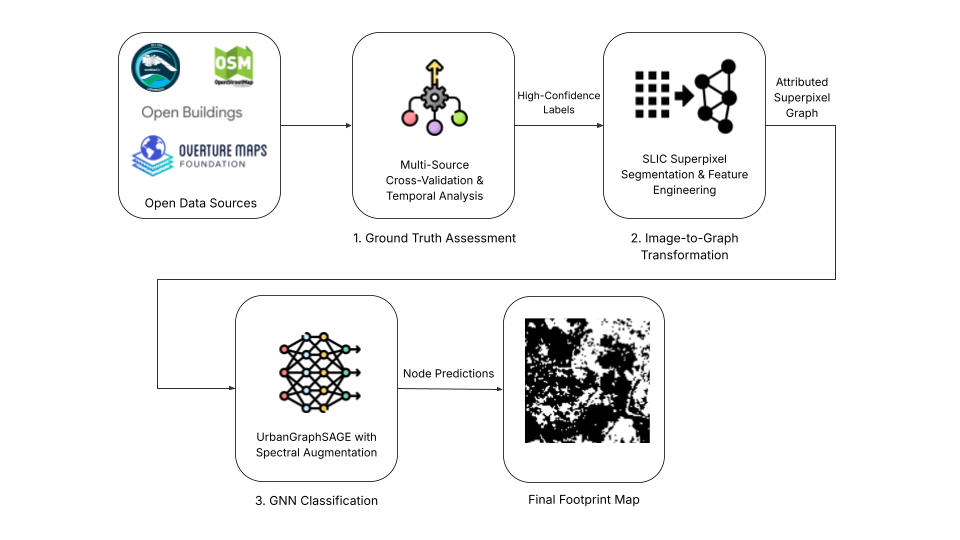
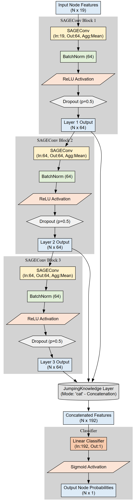
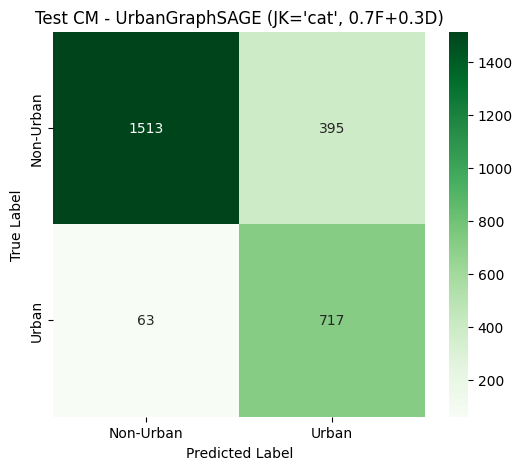

# Urban Building Footprint Extraction using GNNs and Sentinel-2 Imagery

## Abstract

Accurate urban building footprint data is essential for sustainable urban planning (SDG 11). This study introduces a novel framework that overcomes the dual challenges of extracting detailed features from medium-resolution Sentinel-2 imagery and the inherent quality issues of crowdsourced OpenStreetMap (OSM) data. We achieve this by integrating Graph Neural Networks (GNNs) with a rigorous, multi-source data assessment pipeline.

Our objective was to evaluate an UrbanGraphSAGE GNN architecture for segmenting building footprints in Algiers. A foundational component was the creation of a high-confidence ground truth dataset by cross-validating OSM data against Google Open Buildings and Overture Maps, followed by a temporal stability analysis. Our model departs from standard CNNs by first segmenting the imagery into superpixels, which then serve as nodes in a graph. The GNN classifies these nodes by learning from both their spectral features and their spatial context, allowing it to model complex urban morphologies effectively.

The results confirmed the framework's robustness. The final augmented model achieved a strong Test F1-Score of 0.7579 and an excellent recall of 0.9192. This high recall is critical for creating comprehensive urban inventories, as it minimizes the number of missed buildings.

This study validates a powerful framework for leveraging GNNs and rigorously assessed open data for urban monitoring. The methodology offers a scalable and low-cost solution for creating reliable building footprint datasets, providing a valuable tool for planners in rapidly urbanizing cities.

---

## Methodology & Architecture

The project follows a three-stage pipeline, transforming raw pixels into contextual intelligence.

**1. High-Confidence Ground Truth Creation:** A novel data assessment process was implemented, involving multi-source cross-validation and temporal stability analysis to create a final, high-fidelity ground truth dataset of **88,638 reliable building footprints**.

**2. Image-to-Graph Transformation:** The Sentinel-2 imagery was converted into a graph structure where superpixels serve as nodes, attributed with 19 spectral and geometric features.

**3. The UrbanGraphSAGE Model:** A multi-layer GraphSAGE model was designed for node classification (Building vs. Non-Building), featuring a JumpingKnowledge layer to create a rich, multi-scale feature representation.

  

---

## Results & Performance

The final augmented model demonstrated exceptional performance in identifying building footprints in the complex Algiers study area.

*   **F1-Score:** **0.7579**
*   **Recall:** **0.9192** (Critical for minimizing missed buildings in urban inventories)
*   **Precision:** **0.6448**
*   **Accuracy:** **0.8296**

---

## Repository Contents

*   `Notebook_Urban_Footprint_Detection.ipynb`: The main Jupyter Notebook containing the complete code for data preprocessing, model training, and evaluation.
*   `Thesis_Urban_Footprint_Detection.pdf`: The complete Master's thesis document providing in-depth details.
*   `assets/`: A folder containing the diagrams and visual assets used in this README.

---

## Author

**Anouar Adel**
*   Recent graduate with a Master's degree in Artificial Intelligence & Big Data.

*   **GitHub:** [@AnouarAdel](https://github.com/AnouarAdel)
*   **LinkedIn:** [Anouar Adel](https://www.linkedin.com/in/anouar-adel-0a4928323/)
*   **Email:** [adelanouar60@gmail.com](mailto:adelanouar60@gmail.com)

---

## Acknowledgements

This research was conducted as a final year Master's project for the University of Khemis Miliana and as a professional internship at the **Algerian Space Agency (ASAL)**. The work was developed under the invaluable guidance of my supervisors.

*   **Dr. Meziane IFTENE** (Supervisor) - *Algerian Space Agency*
*   **Dr. Mohammed El Amin LARABI** (Supervisor) - *Algerian Space Agency*
*   **Dr. Mohamed GOUDJIL** (Co-supervisor) - *University of Khemis Miliana*

---

## License

This project is licensed under the MIT License. See the [LICENSE](LICENSE) file for details.
